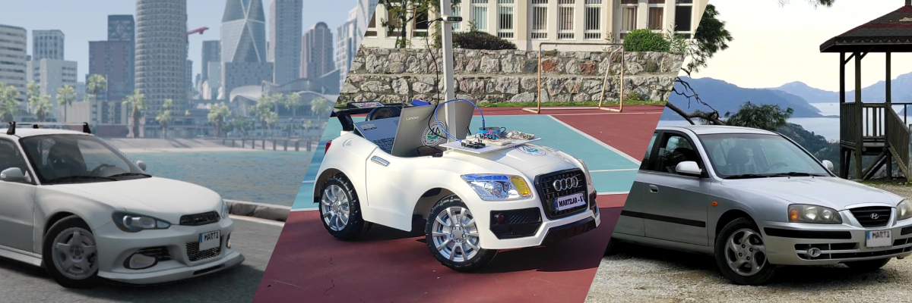
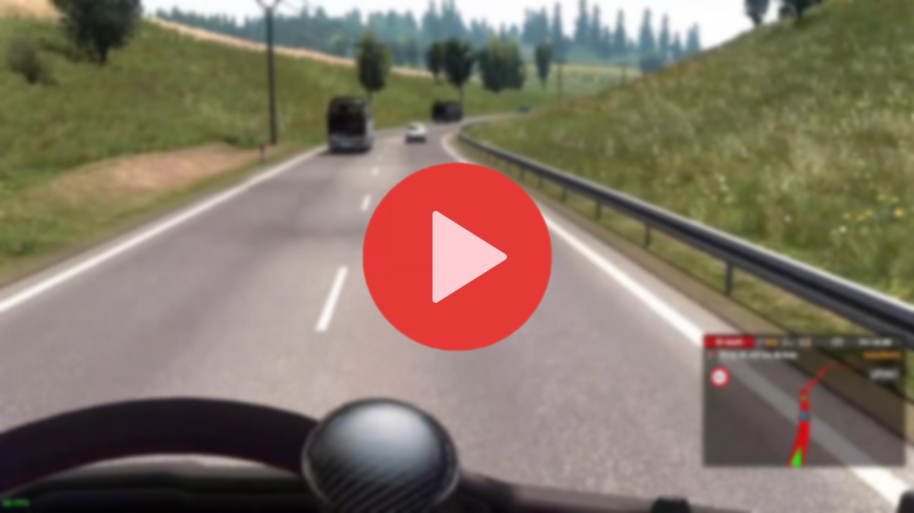
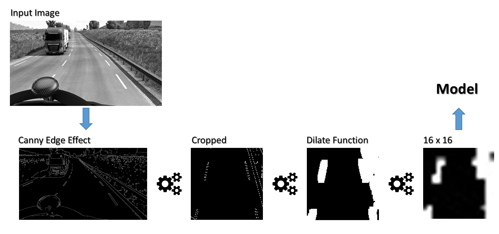
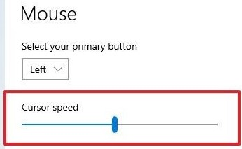
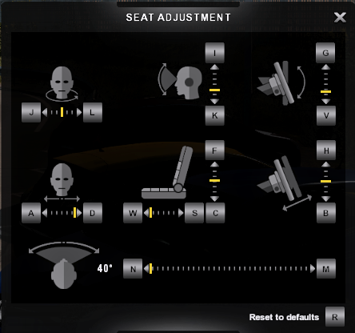
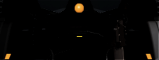

[](http://martilar.tk)
# Changes Over 2 Years:

Over the course of two years,

- :video_game: We used "Assetto Corsa" and "BeamNG.drive" to test. 
- :night_with_stars: And coded our simulator in Unity.
- :movie_camera: We hacked an RC ride-on car and attached a camera to show the real world to our AI.
- :oncoming_automobile: Then we optimized our entire AI system to work with cars instead of trucks in ETS2. When we tested the project on real roads with a real car, we obtained outstanding results with only 37 minutes of driving dataset (all data is syntetic).
- :stop_sign: Additionally, we collected a dataset for detecting traffic signs in Türkiye (~20.000 images), and our project is compatible with both SSD and YOLO models for receiving instructions.
- :triangular_ruler: Moreover, the project can use the RealSense depth camera to measure the distance between detected objects and adjust throttle input.

## :arrow_forward: Click image to watch video

[](https://youtu.be/I_WLtq7Vhv4)

:warning: Currently, we are participating in several competitions with this project; therefore, it is not possible to share a new version of the project as open source. However, in the meantime, we will share some files and instructions to demonstrate our knowledge. This project shows us power of simplifying and cleaning data.

---
---
---

# hope-autonomous-driving

#### Autonomous Driving project for Euro Truck Simulator 2

# Video:

[](https://youtu.be/xuVT6097cig)

## How is it working ?

In this video, the program processes the image of the screen, gives it to the artificial intelligence model, turns the steering wheel according to the result.


I drove the vehicle for 1 hour and also collected data and saved them in a CSV file. I trained the data in the CSV file using [the method and model in this link](https://vijayabhaskar96.medium.com/tutorial-on-keras-flow-from-dataframe-1fd4493d237c).   
The model gives us a pixel value equal to the steering angle of the steering wheel. Then the mouse is moved to this pixel value.

----

## I want to run this

There are things you need to do before running codes:
- You need to install Python ([I used version 3.7.9](https://www.python.org/ftp/python/3.7.9/python-3.7.9-amd64.exe)),
- You have to install the components I use. If this is your first time using Python type in cmd:
```bash
python -m pip install -r requirements.txt
```
- Change the Windows cursor speed to 4
- 
- Set the game to full screen and at 1280x720 resolution,
- Adjust your seat to be the same as in the picture,
- 
- Type in console ([enable console](https://forum.scssoft.com/viewtopic.php?t=61852)):
```bash
c_rsteersens 0.325500
```
- 

Move game window top-left corner (or full screen) and make the steering wheel centered. Press F1 and stop game, run the code and turn back to game. Code will take over steering control. You must not move your mouse before code start.
(Press F1 to stop the code) (Hold "Z" to pass to left lane, hold "X" to pass to right lane)

## Older Versions
They were driving the car using only the A and D keys. It was working with bunch of if-else' instead deep learning. 
  - [Version 1](https://www.instagram.com/p/CJ3B53Dp0hC/)
  - [Version 2](https://www.instagram.com/p/CJ_LCKqpxc_/)
  
## Limitations
:exclamation: Not compatible over 1.40. SCS has changed the way mouse steering works. I wrote new controller that can be used with newer versions of ETS2, but I am hesitant to release it due to fear of being sued.

Not compatible over 1.40. Because high beams don't affect shadows.  
Shadows can confuse the model [(for example this clip)](https://drive.google.com/file/d/1aLDsOZm6rvWgT6dJnb04MZIDKJk0hzMj/view?usp=sharing). To avoid this you can use high beams.  
The supervised learning model is powerful as dataset. If you use 5 or 10 hours of driving footage instead of 1 hour, the model performance will increase amazingly.  
~~If I do it before you do, I'll upload the model here ;)~~ Now I am trying to reduce dataset size while increasing accuracy

## What's Next

  - ~~:white_check_mark: Lane changing~~
  - ~~:gear: Adaptive cruise control~~
  - ~~:white_check_mark: Emergency brake~~
  - ~~Export as exe file~~  
  - *It's not over until we win*

## License
[MIT](LICENSE)
> Special thanks to [r/trucksim](https://www.reddit.com/r/trucksim/comments/kyiv2v/i_made_an_autosteering_project_with_python/) and [r/Python.](https://www.reddit.com/r/Python/comments/lgvojf/i_made_autosteering_project/)
